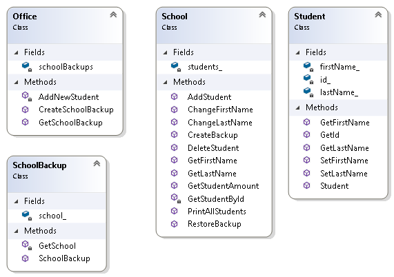

# Wzorzec projektowy Pamiątka (Memento)
## Wstęp
Wzorzec projektowy Pamiątka pozwala zaimplementować funckję "cofnij" znaną z wielu aplikacji (edytory tesktu, programy graficzne itp.). 

## Przykład

Rozważmy przykład aplikacji pozwalającej na modyfikacje listy studentów uczelni. Zadaniem aplikacji jest przechowywanie podstawowych danych studentów: imię, nazwisko, numer studenta. Ponadto aplikacja udostępnia następujące funkcjonalności:
- Dodanie nowego studenta
- Usunięcie studenta
- Modyfikacja danych studenta
- Cofnięcie ostatnio wykonanej modyfikacji

Zastosowanie wzorca projektowego Pamiątka pozwala zaimplementować ostatnią funkcjonalność. 

### Struktura klas

