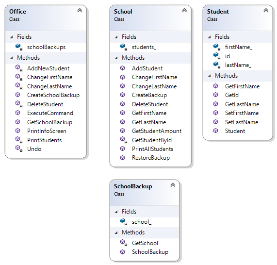

# Wzorzec projektowy Pamiątka (Memento)
## Wstęp
Wzorzec projektowy Pamiątka pozwala zaimplementować funckję "cofnij" znaną z wielu aplikacji (edytory tesktu, programy graficzne itp.). 

## Pojęcia
- Klasa "Zarządca" - klasa przechowująca stany obiektów i zarządzająca nimi
- Klasa "Pamiątki" - klasa odpowiedzialna za wykonywanie kopii stanu obiektu oraz jego przywracanie
- Klasa "Źródłowa" - klasa z danymi źródłowymi, które chcemy składować w celu możliwości wycofania zmian


## Przykład

Rozważmy przykład aplikacji pozwalającej na modyfikacje listy studentów uczelni. Zadaniem aplikacji jest przechowywanie podstawowych danych studentów: imię, nazwisko, numer studenta. Ponadto aplikacja udostępnia następujące funkcjonalności:
- Dodanie nowego studenta
- Usunięcie studenta
- Modyfikacja danych studenta
- Cofnięcie ostatnio wykonanej modyfikacji

Zastosowanie wzorca projektowego Pamiątka pozwala zaimplementować ostatnią funkcjonalność. 

### Struktura klas



### Tworzenie snapshota

```cpp
    office.CreateSchoolBackup(school.CreateBackup());
```

```cpp
std::unique_ptr<SchoolBackup> School::CreateBackup() {
    return std::make_unique<SchoolBackup>(*this);
}
```

```cpp
void Office::CreateSchoolBackup(std::unique_ptr<SchoolBackup> backup) {
    schoolBackups.emplace_back(std::move(backup));
}
```

### Przywrócenie snapshota

```cpp
    school.RestoreBackup(office.GetSchoolBackup());
```

```cpp
std::unique_ptr<SchoolBackup> Office::GetSchoolBackup() {
    std::unique_ptr<SchoolBackup> lastBackup = nullptr;
    if (!schoolBackups.empty()) {
        lastBackup = std::move(schoolBackups.back());
        schoolBackups.pop_back();
    }
    return lastBackup;
}
```

```cpp
void School::RestoreBackup(std::unique_ptr<SchoolBackup> backup) {
    if (backup) {
        *this = backup->GetSchool();
    }
}
```

## Wady

- duże użycie pamięci

## Zalety

- Tworzenie snapshotów bez konieczności naruszania hermetyzacji
- Klasa zarządzająca odpowiada za zarządzanie historią zmian, klasa źródłowa nie jest odpowiedzialna za przywracanie zmian (Single Responsibility Principle)


## Źródła:
- https://refactoring.guru/design-patterns/memento
- W przykładowym programie użyto biblioteki nagłówkowej do formatowania tekstu w konsoli: https://github.com/haarcuba/cpp-text-table
